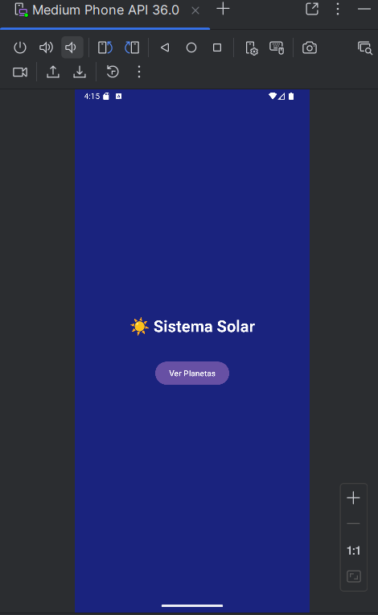
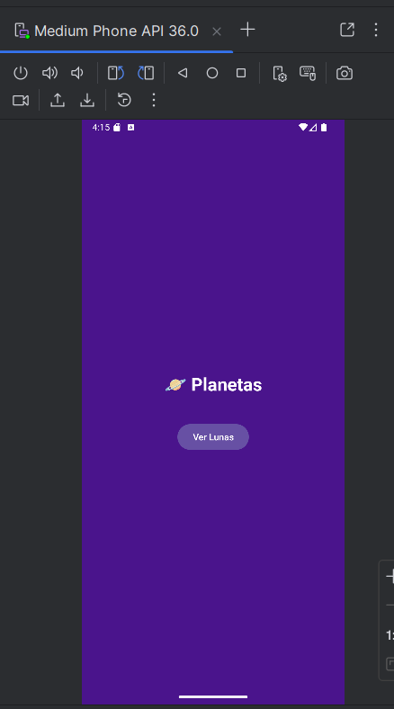
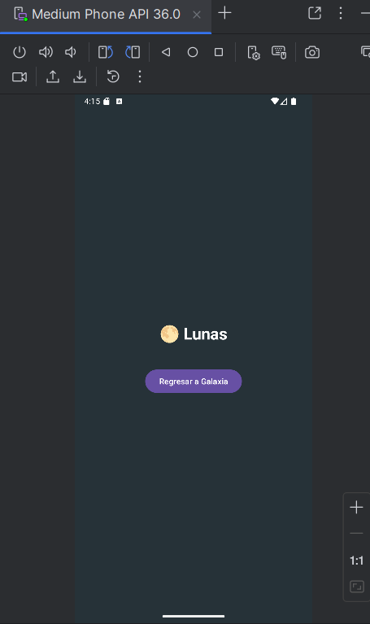
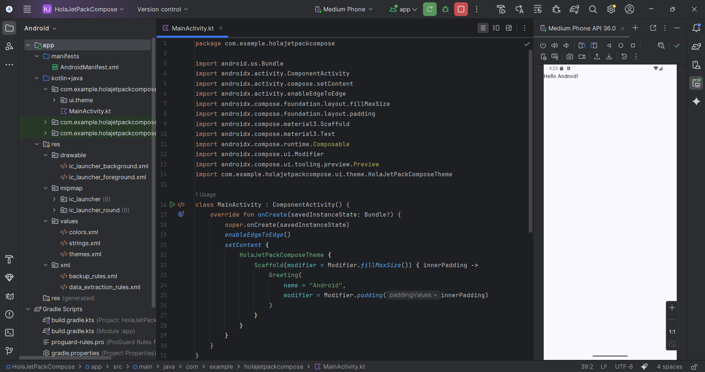
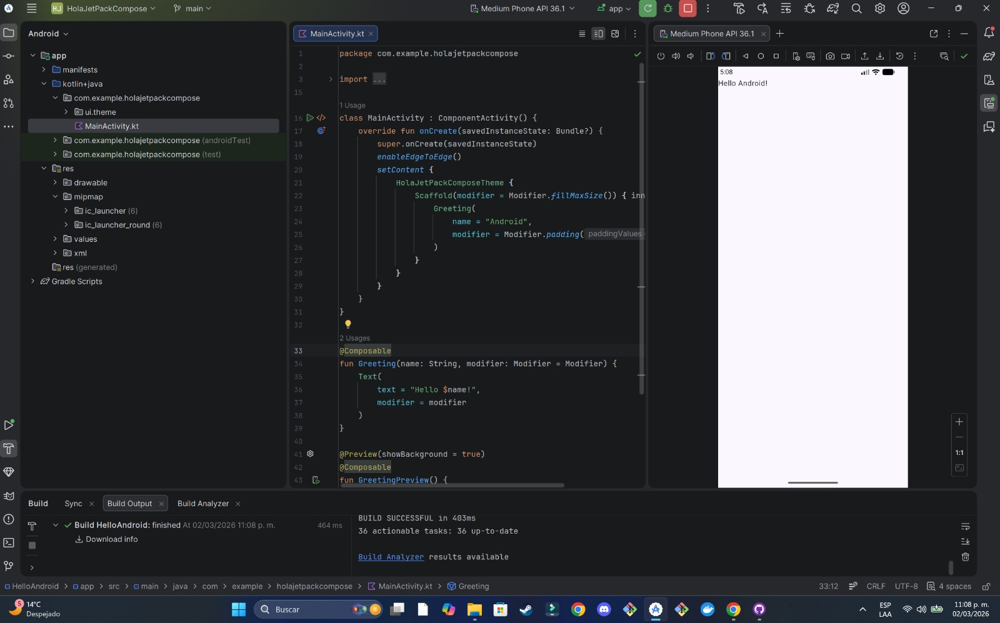

# 🌌 Explorador de la Vía Láctea

Aplicación Android desarrollada en Kotlin que demuestra una navegación jerárquica utilizando múltiples Activities.  
El proyecto simula una exploración estructurada desde la galaxia hasta las lunas del Sistema Solar.

---

## 📱 Estructura de Activities

La aplicación está organizada en cuatro niveles jerárquicos:

### 1️⃣ MainActivity (Vía Láctea)
Pantalla principal de la aplicación.  
Representa la galaxia y contiene un botón que permite navegar al Sistema Solar.

### 2️⃣ SistemaSolarActivity
Representa el nivel del Sistema Solar.  
Desde aquí se puede acceder a la sección de Planetas.

### 3️⃣ PlanetasActivity
Muestra la sección de Planetas.  
Incluye un botón que permite navegar hacia las Lunas.

### 4️⃣ LunasActivity
Último nivel de la jerarquía.  
Permite regresar al inicio de la aplicación.

---

## 🔄 Manejo de Transiciones y Ciclo de Vida

### Navegación

La navegación entre pantallas se implementó mediante `Intent` explícitos utilizando `startActivity()`.

Cada botón crea un Intent para abrir la siguiente Activity dentro de la jerarquía.

Para regresar al inicio desde la última pantalla se utilizó `finishAffinity()`, cerrando todas las Activities activas.

### Ciclo de Vida

Cada Activity utiliza el método `onCreate()` para:

- Inicializar la interfaz gráfica.
- Configurar los botones.
- Establecer los eventos de navegación.

---

## ▶️ Instrucciones para Ejecutar la Aplicación

1. Clonar el repositorio:
2. Abrir el proyecto en Android Studio.
3. Esperar la sincronización de Gradle.
4. Ejecutar la aplicación en un emulador o dispositivo físico.

---

## 📸 Capturas de Pantalla

### 🏠 Menú Principal

### 🪐 Navegación Planetas → Lunas

### Capturas Hello Android Brian
 

### Capturas Hello Android Karla
 

